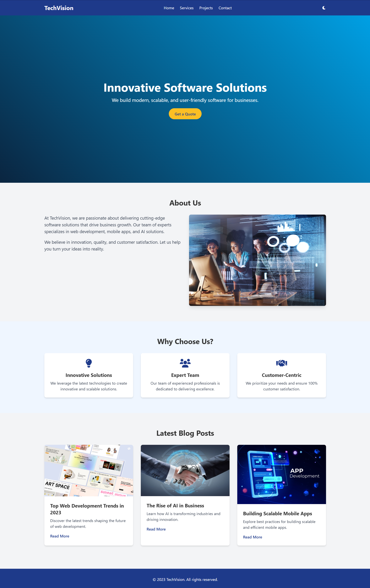

# TechVision - Software Agency Website

 <!-- Add a screenshot of your project here -->

TechVision is a modern, responsive, and interactive website for a software agency. It showcases the agency's services, projects, testimonials, and contact information. The website is built using **HTML**, **Tailwind CSS**, and **JavaScript**, with additional libraries like **Swiper.js** and **AOS** for enhanced interactivity and animations.

---

## Features

- **Responsive Design**: Works seamlessly on all devices (desktop, tablet, mobile).
- **Dark/Light Mode**: Toggle between dark and light themes with persistent user preference.
- **Interactive Testimonial Slider**: Powered by Swiper.js for smooth transitions and touch support.
- **Animated Sections**: Scroll animations using AOS (Animate On Scroll).
- **Contact Form**: A simple contact form for user inquiries (no backend functionality).
- **Project Showcase**: Displays completed projects with a card-based UI.
- **Service Pages**: Detailed descriptions of services offered by the agency.
- **Pricing Plans**: Transparent pricing tables for different service tiers.
- **Google Maps Integration**: Embedded map for the agency's location.

---

## Technologies Used

- **Frontend**:
  - HTML5
  - Tailwind CSS
  - JavaScript
- **Libraries**:
  - [Swiper.js](https://swiperjs.com/) - For the testimonial slider.
  - [AOS (Animate On Scroll)](https://michalsnik.github.io/aos/) - For scroll animations.
  - [Font Awesome](https://fontawesome.com/) - For icons.
- **Other Tools**:
  - Google Maps API - For the embedded map.
  - Particle.js - For the animated background in the hero section.

---

## Setup Instructions

### 1. Clone the Repository
```bash
git clone https://github.com/your-username/techvision-website.git
cd techvision-website